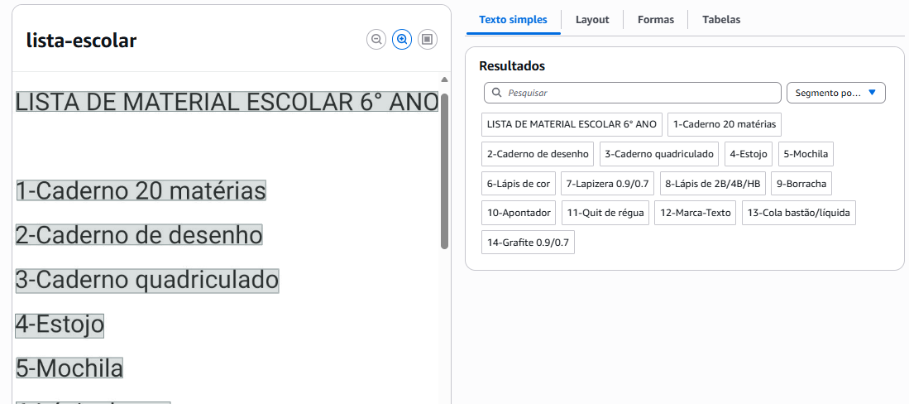
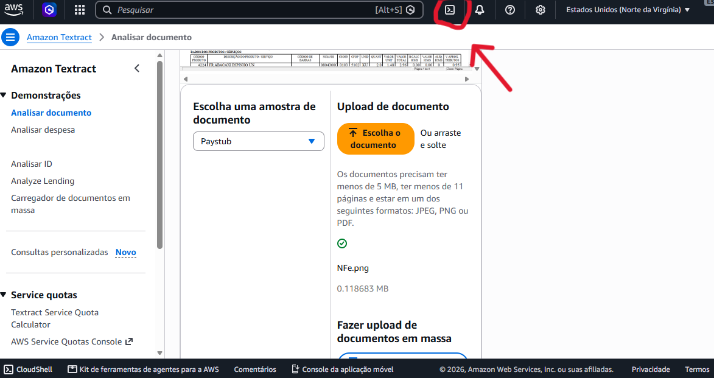
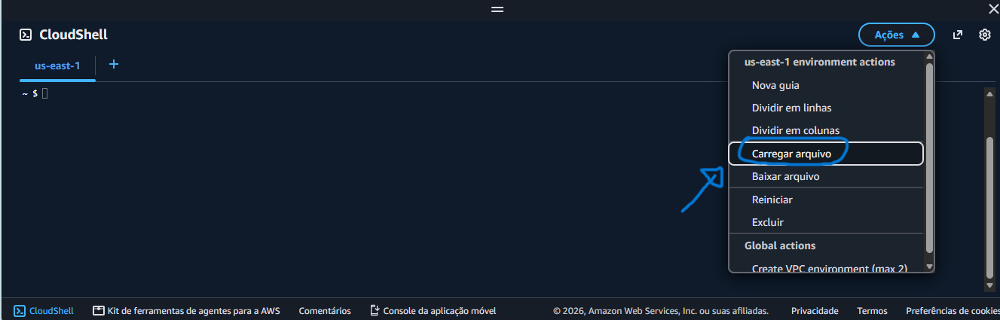
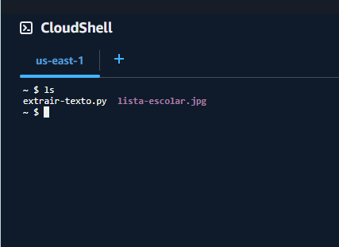
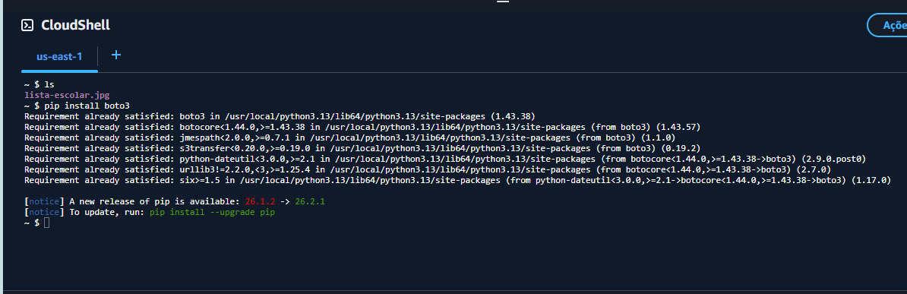
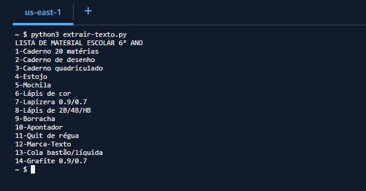

# desafioDIO-textract
Neste desafio foi pedido para gerar um código em python que imprima o texto extraído de uma imagem com o uso AWS Textract 

Optei em usar o AWS CloudShell ao invés do AWS CLI para a execução do desafio, pois desta forma é possível testar sem instalar nada na minha máquina. 

Documentação:
- [AWS CloudShell](https://docs.aws.amazon.com/cloudshell/)
- [Amazon Textract](https://docs.aws.amazon.com/pt_br/textract/)

Primeiramente, acessamos a nossa conta e abrimos o Amazon Textract para verificar se ele esta conseguindo extrair as informações da imagem corretamente. Testei algumas imagens e a extração não foi a ideal com extração incompleta por dificuldade de reconhecer as palavras ou por frases completas estarem em diferentes linhas o que não deixa muito amigável. Então, decidi usar uma lista de material escolar parecida com o do professor para fazer a extração dos dados com o python.

No Amazon Textract o melhor formato foi texto simples que conseguiu extrair as linhas corretamente. Veja o print abaixo:

Para acessar a AWS Cloud Shell você loga na sua conta aws e clica no ícone na barra superior direita

 
Dentro do terminal você acessa Ações ( no canto superior direito) e subir no terminal a imagem da lista escolar e o código Python.

No caso do código você pode criar o arquivo dentro do próprio terminal , mas preferi criá-lo na IDE para facilitar a identação e depois subi ela no terminal.

A explicação de cada linha do código se encontra dentro dele em: [Extrair-Texto.py](extrair-texto.py)
Para verificar se os arquivos subiram no terminal digite ls e mostrará o que está no terminal

Feito isso, você terá que instalar o boto3 para conseguir fazer a conexão do Textract com seu código Python. Insira no terminal
pip install boto3

Pronto! Agora está tudo preparado para testar seu código. Você chama o seu código python no terminal com: 
python3 nomedoarquivodocodigo.py . 
No meu caso o arquivo chama-se extrair-texto.py, então fica: python3 extrair-texto.py
E o resultado mostra o texto extraído de cada linha da imagem usando o Textract e o código Python.

